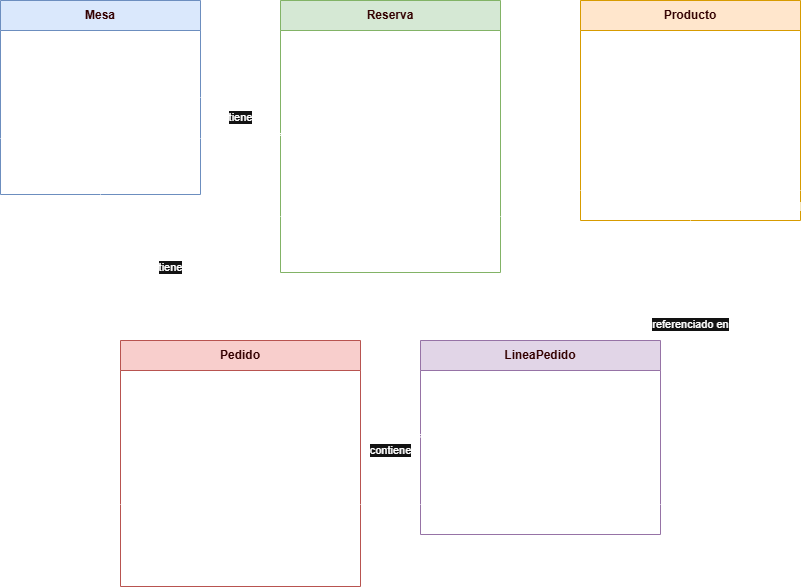

# Restaurante App

## Descripción
Proyecto de Trabajo de Fin de Grado (TFG) para el Grado Superior en Desarrollo de Aplicaciones Multiplataforma (DAM).
Sistema de gestión para un restaurante: control de mesas, reservas, pedidos y productos.

Este repositorio recoge el trabajo de preparación del TFG, iniciado durante el verano previo al segundo curso,
con el objetivo de asentar las bases del diseño (modelo de datos y modelo de clases) antes de comenzar
el desarrollo de la aplicación en el curso siguiente.

## Estado del proyecto
En fase de diseño. Actualmente el repositorio contiene el modelo de datos relacional y el modelo de clases
de la aplicacion. El desarrollo del codigo de la aplicacion (Java) se abordara durante el segundo curso del grado.

## Diagrama de clases


Ver tambien `modelo.md` para la descripcion textual de cada clase, y `modelo_clases_restaurante.drawio`
para el archivo editable.

## Tecnologias

Ya utilizadas:
- SQL (MySQL 8.0) - diseno y consultas de base de datos
- Git / GitHub - control de versiones

Previstas para el desarrollo de la aplicacion (curso 2):
- Java - lenguaje principal de la aplicacion
- Framework y librerias concretas aun por decidir segun el temario del segundo curso

## Estructura del repositorio
- `schema.sql` - definicion de las tablas (Mesa, Reserva, Producto, Pedido, LineaPedido)
- `datos_prueba.sql` - datos de ejemplo para probar el esquema
- `consulta_stock_bajo_media.sql` - consulta SQL de ejemplo (subconsulta correlacionada)
- `modelo.md` - modelo de clases en texto
- `modelo_clases_restaurante.drawio` - diagrama de clases (editable en draw.io)
- `diagrama_de_clases_explanation.md` - justificacion de las decisiones de diseno
- `pantalla_mesas.js` - prototipo de practica (ejercicio de ramas de Git)

## Como ejecutar el esquema de base de datos

1. Instala MySQL Server 8.0 o superior.
2. Crea una base de datos nueva:
```sql
   CREATE DATABASE restaurante;
   USE restaurante;
```
3. Carga el esquema y los datos de prueba:
```bash
   mysql -u root -p restaurante < schema.sql
   mysql -u root -p restaurante < datos_prueba.sql
```
4. Comprueba que las tablas se crearon correctamente:
```sql
   SHOW TABLES;
```

## Autor
Josue - Grado Superior en Desarrollo de Aplicaciones Multiplataforma (DAM)
